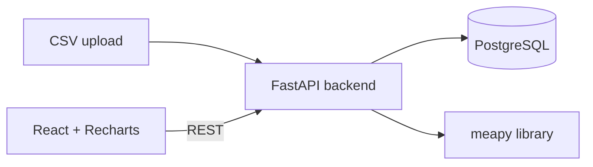

# MEA Pilot Plant Dashboard

Real-time monitoring dashboard for an MEA (monoethanolamine) carbon capture pilot plant.
Backend (FastAPI + Postgres) ingests CSV exports from the plant historian, runs alarm
checks, and exposes the [meapy](https://github.com/defnalk/meapy) chemical engineering
calculations. Frontend (React + Recharts) renders sensor cards, time series charts,
alarm history, and on demand analyses.

## Architecture



## Quickstart

```bash
docker compose up --build
```

- API:       http://localhost:8000/api/v1
- API docs:  http://localhost:8000/docs
- Frontend:  http://localhost:5173

Sample CSVs live in `backend/sample_data/`.

## Tech stack

| Layer    | Tools |
|----------|-------|
| Backend  | Python 3.12, FastAPI, SQLAlchemy 2.0 (async), Alembic, asyncpg, Pydantic v2 |
| Frontend | React 18, TypeScript, Vite, Tailwind 3, TanStack Query v5, Recharts, Zustand |
| Infra    | Docker Compose, GitHub Actions CI, Fly.io |
| Tests    | pytest + httpx, Vitest + React Testing Library |
| Domain   | [meapy](https://github.com/defnalk/meapy) for heat transfer / pump / mass transfer math |

## Repo layout

```
backend/   FastAPI app, models, services, alembic migrations, tests, sample CSVs
frontend/  React + Vite SPA, TanStack Query hooks, Tailwind UI
```

See `backend/README.md` and `frontend/README.md` for per service setup.
